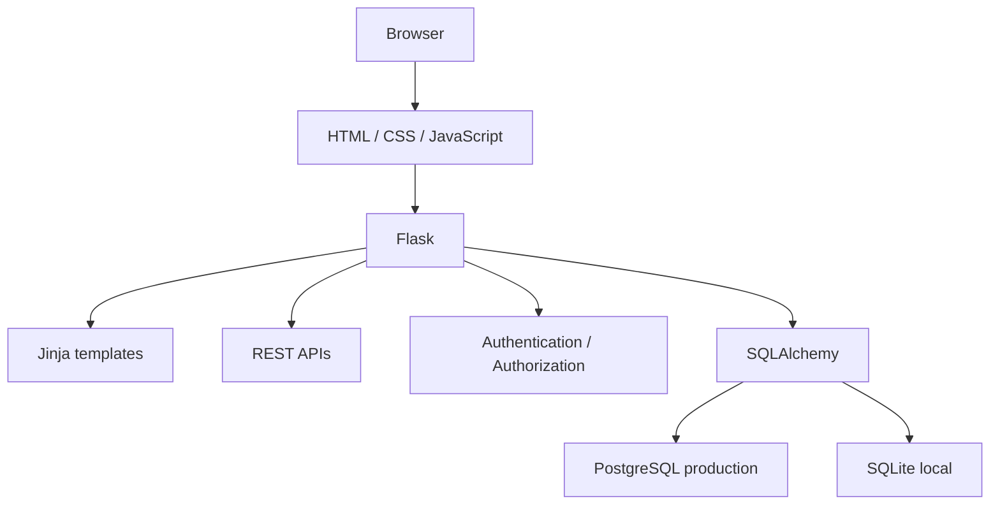
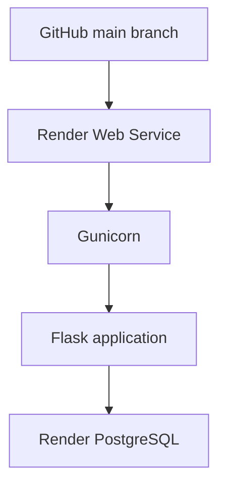
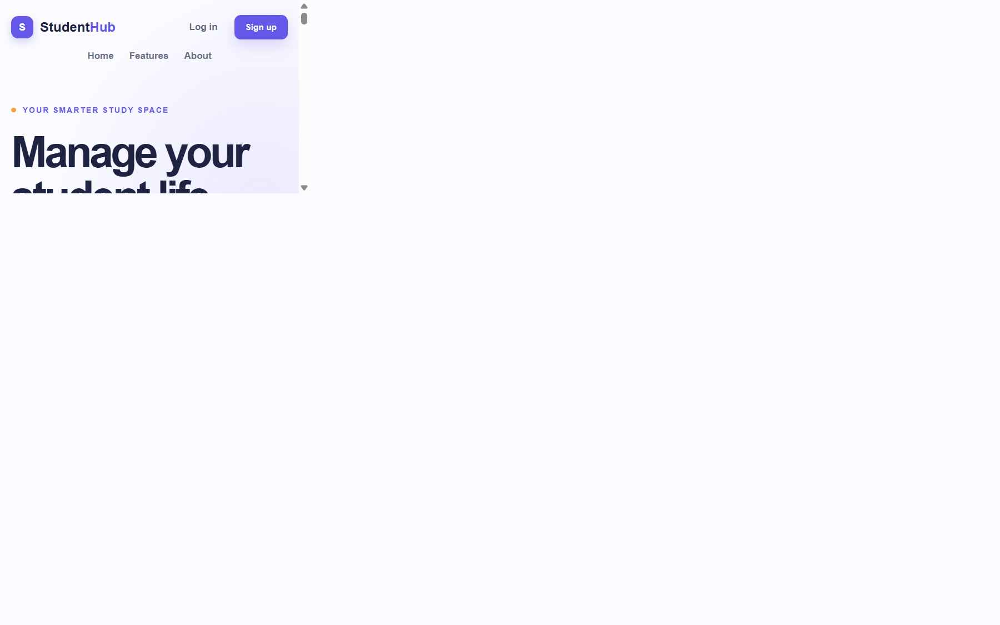
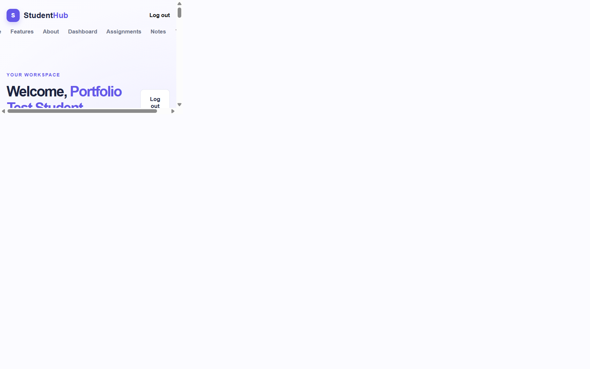
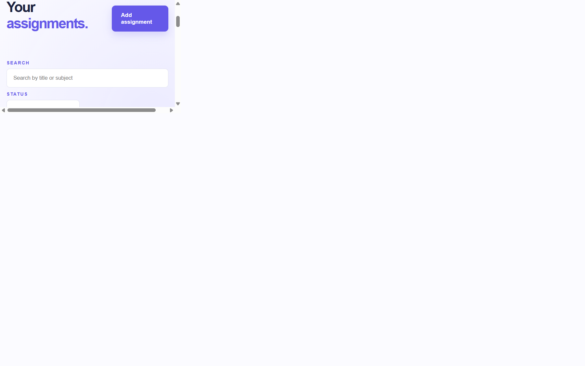
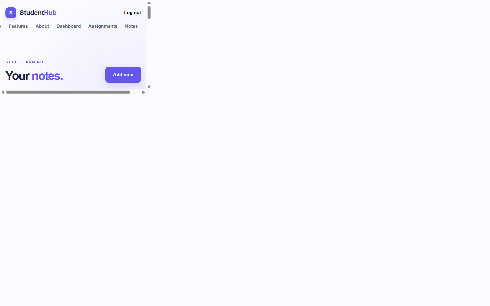
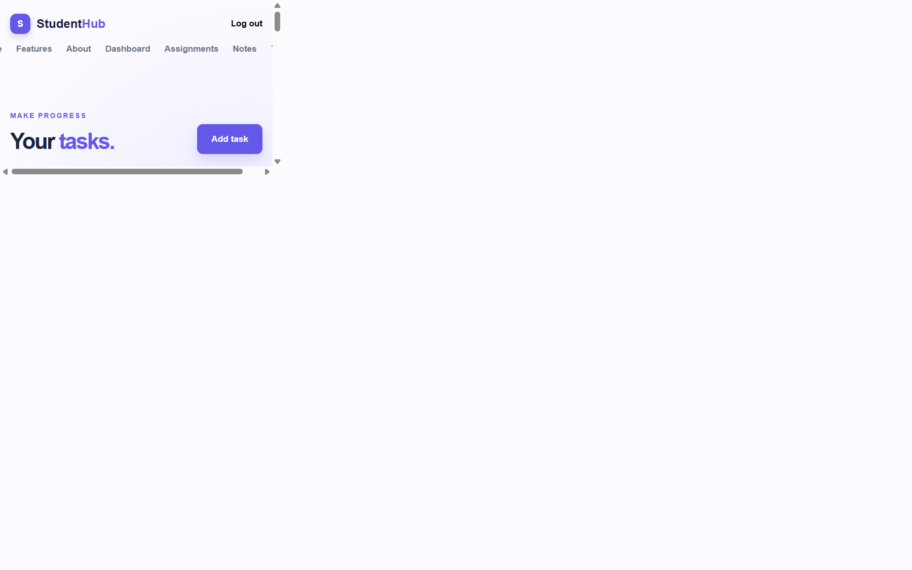

# StudentHub

StudentHub is a Flask-based student productivity platform for managing assignments, study notes, and tasks in one authenticated workspace. It combines server-rendered pages with JavaScript-powered REST APIs and uses SQLite locally with PostgreSQL in production.

## Live Demo

https://studenthub-hnhg.onrender.com

## Features

- User registration with secure password hashing
- Login, logout, and session-based authentication
- User-specific authorization and ownership checks
- Assignment CRUD
- Notes CRUD
- Tasks CRUD
- Task completion toggle
- Dashboard statistics and recent data
- Client-side search and filtering for assignments, notes, and tasks
- JSON REST APIs used by the browser interface
- JavaScript `fetch()` interactions
- Jinja template inheritance
- PostgreSQL production database
- SQLite local development database
- CSRF protection, server-side validation, and security headers
- `/health` endpoint for deployment health checks

## Tech Stack

### Frontend

- HTML
- CSS
- JavaScript

### Backend

- Python
- Flask
- Jinja

### Database

- SQLite for local development
- PostgreSQL for production

### ORM

- SQLAlchemy / Flask-SQLAlchemy

### Production

- Gunicorn
- Render

### Version Control

- Git
- GitHub

## Architecture



The browser receives application pages from Flask and uses JavaScript `fetch()` for interactive data operations. Flask renders Jinja templates, exposes JSON endpoints, and enforces authentication, CSRF protection, validation, and ownership checks. Flask-SQLAlchemy provides the database layer, with the database URL selecting PostgreSQL in production and SQLite for local development.

## Main Modules

- **Authentication:** Users can register, log in, and log out. Passwords are hashed before storage, and protected pages use session-based authentication.
- **Dashboard:** Shows assignment, note, and task statistics along with recent assignments and tasks.
- **Assignments:** Users can create, view, edit, delete, search, and filter assignments by status.
- **Notes:** Users can create, view, edit, delete, search, and filter study notes.
- **Tasks:** Users can create, view, edit, delete, search, filter, and toggle task completion.
- **REST APIs:** JSON endpoints support dashboard data and CRUD operations used by the JavaScript interface.

## CRUD

Assignment management follows the standard CRUD lifecycle:

- **Create:** Add an assignment with a title, subject, due date, description, and status.
- **Read:** Load the authenticated user's assignments through the page or JSON API.
- **Update:** Edit assignment details or status.
- **Delete:** Remove an assignment owned by the authenticated user.

Notes and tasks use the same create, read, update, and delete pattern. Tasks also support a completion toggle.

## Security

StudentHub includes several application-level security measures:

- Password hashing with Werkzeug
- HTTP-only and environment-aware session cookies
- CSRF protection for state-changing requests
- Server-side input validation
- Authentication and authorization checks on protected operations
- User ownership checks for assignments, notes, and tasks
- Jinja autoescaping for rendered templates
- Environment-based secret configuration
- Production debug mode disabled
- Security response headers, including CSP and frame protection
- Sensitive files and local databases ignored by Git

The application uses these protections as part of its implementation, but no application should be considered completely secure without ongoing review and testing.

## Database

Local development uses SQLite stored in the local `studenthub.db` file. This keeps setup simple and avoids requiring a database server for development.

Production uses managed Render PostgreSQL through `DATABASE_URL`. A managed PostgreSQL service is better suited to a deployed multi-process web service than a local SQLite file and keeps production data separate from local development data.

## Project Structure

```text
StudentHub/
├── app.py                 # Flask app, models, routes, and REST APIs
├── requirements.txt       # Python and production dependencies
├── .env.example           # Environment variable names and placeholders
├── .gitignore             # Ignored secrets, databases, environments, and caches
├── templates/             # Jinja templates and page layouts
│   ├── base.html
│   ├── dashboard.html
│   ├── assignments.html
│   ├── notes.html
│   └── tasks.html
├── static/
│   ├── style.css          # Application styles
│   └── script.js          # Fetch-based browser interactions
├── studenthub.db          # Local SQLite data; ignored by Git
└── myenv/                 # Local virtual environment; ignored by Git
```

The repository also contains the remaining page-specific templates for authentication, informational pages, and create/edit forms. Local environment and database entries in the tree are development-only and are not intended for GitHub.

## API Endpoints

All data APIs require an authenticated session. State-changing requests also require the CSRF token supplied by the page.

### Assignments

| Method | Endpoint | Purpose |
| --- | --- | --- |
| GET | `/api/assignments` | List the current user's assignments |
| POST | `/api/assignments` | Create an assignment |
| PUT | `/api/assignments/<id>` | Update an owned assignment |
| DELETE | `/api/assignments/<id>` | Delete an owned assignment |

### Notes

| Method | Endpoint | Purpose |
| --- | --- | --- |
| GET | `/api/notes` | List the current user's notes |
| POST | `/api/notes` | Create a note |
| PUT | `/api/notes/<id>` | Update an owned note |
| DELETE | `/api/notes/<id>` | Delete an owned note |

### Tasks

| Method | Endpoint | Purpose |
| --- | --- | --- |
| GET | `/api/tasks` | List the current user's tasks |
| POST | `/api/tasks` | Create a task |
| PUT | `/api/tasks/<id>` | Update an owned task |
| DELETE | `/api/tasks/<id>` | Delete an owned task |
| POST | `/api/tasks/<id>/toggle` | Toggle task completion |

### Dashboard

| Method | Endpoint | Purpose |
| --- | --- | --- |
| GET | `/api/dashboard/stats` | Return dashboard counts |
| GET | `/api/dashboard/recent-assignments` | Return recent assignments |
| GET | `/api/dashboard/recent-tasks` | Return recent tasks |

The deployment health endpoint is `GET /health` and returns a small JSON status response without requiring authentication.

## Local Setup

These commands are for Windows PowerShell.

### 1. Clone the repository

```powershell
git clone https://github.com/kashishchaudhari65986-dot/StudentHub.git
cd StudentHub
```

### 2. Create a virtual environment

```powershell
py -m venv myenv
```

### 3. Activate the environment

```powershell
.\myenv\Scripts\Activate.ps1
```

If PowerShell blocks activation, use the environment's interpreter directly:

```powershell
.\myenv\Scripts\python.exe --version
```

### 4. Install dependencies

```powershell
python -m pip install -r requirements.txt
```

### 5. Configure environment variables

Set a local secret in PowerShell. Leave `DATABASE_URL` unset to use the local SQLite database, or set it to a PostgreSQL connection string when testing against PostgreSQL.

```powershell
$env:STUDENTHUB_SECRET_KEY = "use-a-local-secret"
```

### 6. Run Flask locally

```powershell
python app.py
```

### 7. Open the application

Open http://127.0.0.1:5000 in a browser.

The built-in Flask server is intended for local development. Render uses Gunicorn for the deployed service.

## Environment Variables

Only variable names are documented here; values belong in the local shell or Render environment settings and should never be committed.

- `STUDENTHUB_SECRET_KEY`: Secret used to sign Flask sessions. Use a strong random value in production.
- `DATABASE_URL`: Optional database connection string. When set in production, it selects the managed PostgreSQL database; when unset locally, StudentHub falls back to SQLite.

## Deployment



The live application is connected to the public GitHub repository's `main` branch through a Render Web Service. Render installs `requirements.txt`, starts the application with Gunicorn, and supplies the production PostgreSQL connection through the service environment. Render uses `/health` to check service health.

## Testing

The deployed application was verified with:

- Signup, login, dashboard access, and logout using a disposable test account
- Authenticated assignment, note, and task API operations
- Assignment, note, and task create, update, delete, and task-toggle operations
- Dashboard statistics and recent-data API responses
- Session rejection after logout
- Health endpoint and core page checks for `/`, `/login`, and `/signup`
- Deployment verification against the live Render service and current `main` commit

Ownership-scoped routes and authorization checks were reviewed during deployment verification. A dedicated cross-account isolation test suite would be a useful future addition.

## Screenshots

These screenshots show the deployed StudentHub application and its main authenticated workflows.

### Homepage



### Dashboard



### Assignment Management



### Notes Management



### Task Management



## Future Improvements

Possible future improvements include:

- Email reminders
- Calendar integration
- Richer analytics
- File attachments
- Notifications
- A mobile version

These are ideas for future development, not current features.

## License

This repository does not currently include a license. A license can be added later if the project is intended for reuse.

## Author

Kashish Chaudhari
